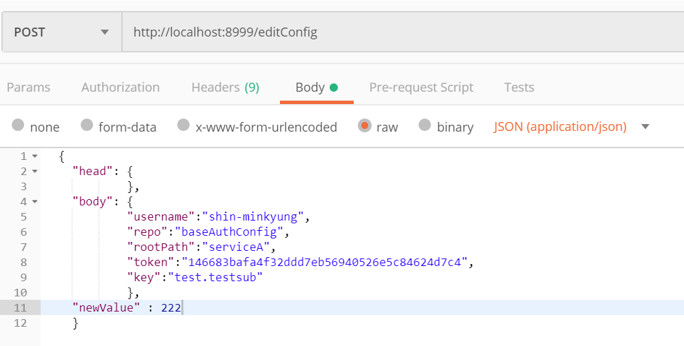
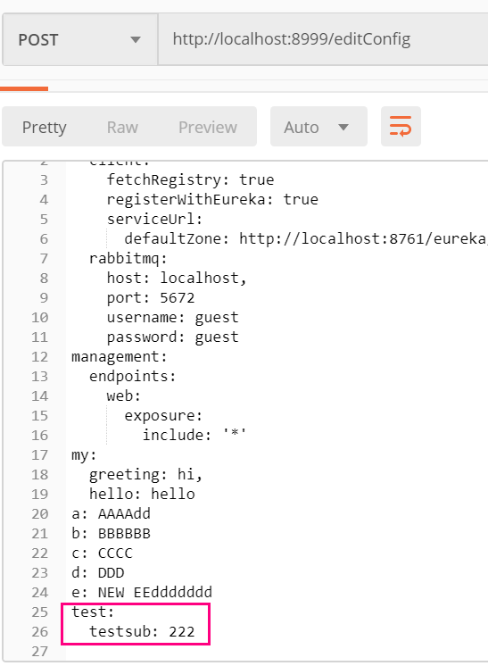

# API for Spring Cloud Config Server
컨피그 서버에 바꿀 설정키와 값을 요청하면 레파지토리의 설정파일이 수정되는 API입니다

# 사용법

수정요청사항을 Json형식으로 요청합니다. 
 - username: 깃허브의 계정이름
 - repo : repository의 이름
 - rootPath : 수정할 파일이 있는 경로
 - token : 쓰기 권한이 있는 깃계정 토큰 OAuth2
 - key: 설정파일(yml)에서 추가하거나 수정할 키(property)의 이름
 - newValue : key의 값에 해당하는 값. String이 아니면 더블쿼트를 입력하지 않는것이 중요합니다
 
 수정전의 yml파일 내용입니다.
 
 
 
 test.testsub가 있으면 수정하고 없으면 추가하라는 POST 요청을 한 결과를 리턴합니다. 
 
 
