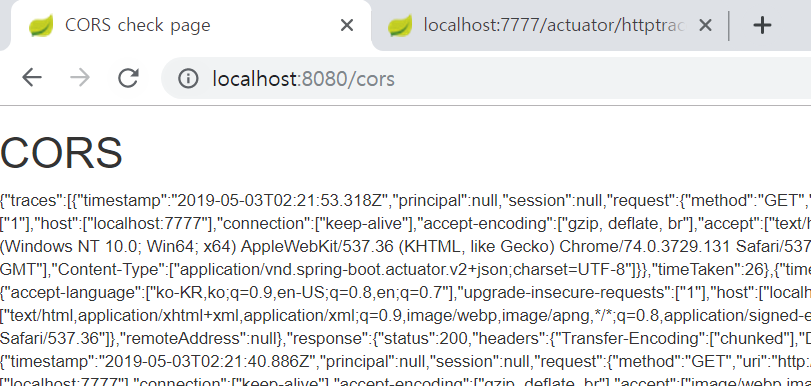

# CORS_sample
sample coding to test CORS

# mainServerCors
메인서버는 CORS 요청을 받는, 자원을 공유해주는 서버입니다.
Spring Actuator의 httptrace 정보를 볼수 있는 엔드포인트입니다.
이 데이터를 다른 서버에서 CORS 요청할 수 있습니다.
actuator데이터 요청은 예제이며 어떤 데이터든 요청할 수 있습니다.

# cors
<code></code>
메인서버의 자원을 cors 요청하여 화면에 표시합니다.

